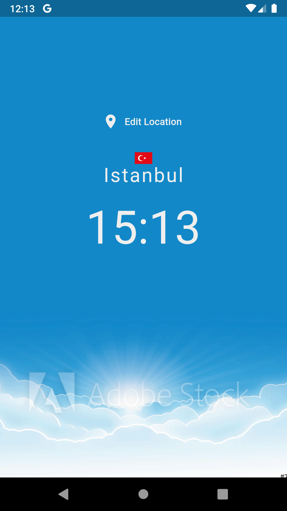
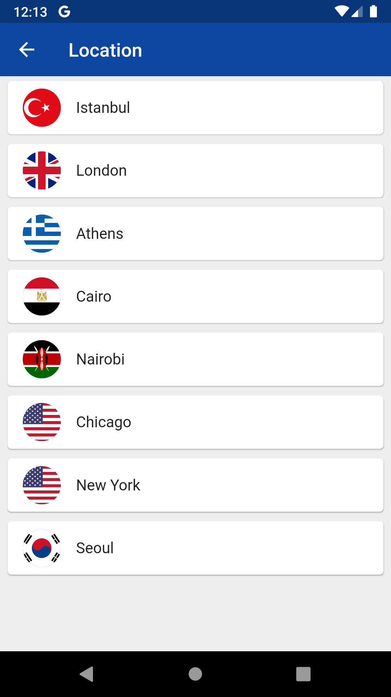
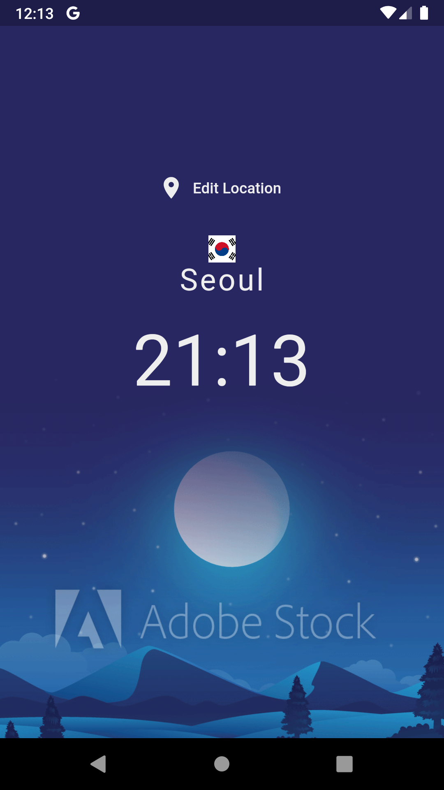

# World Time App

This project is a sample project for flutter using world time api to show local time from all over the world.

<!-- Place this tag where you want the button to render. -->
### ScreenShots

For help getting started with Flutter, view our
[online documentation](https://flutter.dev/docs), which offers tutorials,
samples, guidance on mobile development, and a full API reference.
